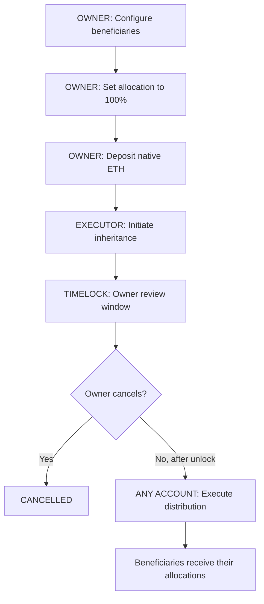
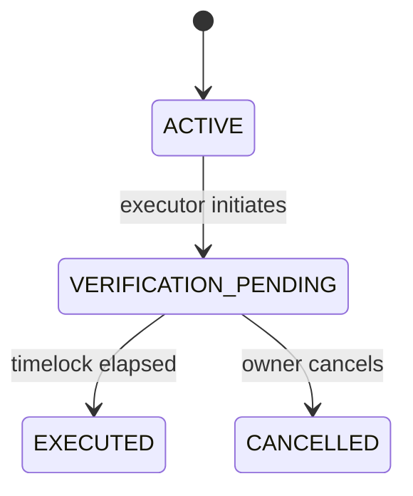

# Heirloom

> A blockchain-based digital inheritance management DApp with beneficiary allocation, executor-controlled initiation, and configurable timelock protection.

[](https://opensource.org/license/mit)
[](https://soliditylang.org/)
[](https://sepolia.etherscan.io/)

## Overview

Heirloom is an academic prototype for managing predefined inheritance instructions on-chain. A single `DigitalInheritance.sol` contract records beneficiaries, percentage-based allocations, native ETH deposits, an authorized executor, and the plan lifecycle.

The executor initiates inheritance after an off-chain verification step. A configurable timelock gives the owner an opportunity to cancel before anyone executes the final distribution. Contract events and lifecycle state provide a transparent on-chain history.

## Architecture

```text
MetaMask
   |
   v
DigitalInheritance.sol
   |
   v
Ethereum Sepolia
```

The application uses one deployed inheritance contract. MetaMask provides wallet access and signs transactions; the frontend reads contract state through ethers.js and public JSON-RPC infrastructure.

## Key Features

- MetaMask wallet connection and account switching
- Ethereum Sepolia support with local Ganache development support
- Beneficiary registration, removal, and percentage updates
- Allocation validation with a required 100% total before initiation
- Owner-managed executor configuration
- Native ETH deposits held by the contract
- Configurable timelock duration from 1 to 365 whole days
- Executor-controlled inheritance initiation
- Owner cancellation during the active timelock
- Public execution after the timelock expires
- Transaction feedback, status badges, and lifecycle-aware actions
- On-chain activity history from contract events
- Responsive dashboard with light and dark themes

## How It Works



## Lifecycle



## Security and Design Notes

- Owner-only modifiers protect beneficiary, executor, document, deposit, and timelock configuration.
- Only the configured executor can initiate inheritance.
- Beneficiary addresses must be valid, non-zero, unique, and different from the owner and executor.
- Percentage allocations must be positive and cannot exceed 100% in total; initiation requires exactly 100%.
- Status-based restrictions prevent configuration after initiation, repeated execution, and cancellation outside the timelock state.
- Distribution updates status and clears the tracked deposit before external ETH transfers, following checks-effects-interactions ordering.
- The timelock duration can be changed only while the plan is `ACTIVE`; the unlock timestamp is fixed when initiation occurs.
- The contract uses the blockchain timestamp as the source of truth for the timelock. The frontend synchronizes countdowns with the latest block timestamp.

This is an academic prototype and has not undergone a professional security audit.

## Tech Stack

[](https://skillicons.dev)

| Layer | Technology |
| --- | --- |
| Smart contract | Solidity 0.8.20 |
| Blockchain | Ethereum Sepolia; Ganache for local development |
| Development framework | Truffle |
| Frontend | Static HTML, CSS, and JavaScript |
| Wallet | MetaMask |
| Web3 library | ethers.js 5.7 via CDN |
| Contract testing | Mocha/Truffle with `@openzeppelin/test-helpers` |

## Project Structure

```text
contracts/
  DigitalInheritance.sol
migrations/
  2_deploy_inheritance.js
test/
  digitalInheritance.test.js
frontend/
  index.html
  index.backup.html
  app.js
  contract-service.js
  config.js
  styles.css
scripts/
  check-frontend.cjs
build/contracts/
  DigitalInheritance.json
truffle-config.js
package.json
README.md
```

## Installation and Local Development

### Prerequisites

- Node.js and npm
- Ganache
- MetaMask

### Install and test

```bash
npm install
npm test
npm run frontend:build
```

### Run Ganache locally

Start the deterministic local chain on port `7545`:

```bash
npm run ganache:heirloom
```

In another terminal, compile and deploy the local contract:

```bash
npm run compile
npm run migrate
```

### Serve the frontend

```bash
npm run frontend:serve
```

Open [http://127.0.0.1:4173](http://127.0.0.1:4173). For ES module support, use the HTTP server rather than opening the page directly from `file://`.

## Sepolia Deployment

To use the public deployment, switch MetaMask to Ethereum Sepolia:

- Chain ID: `11155111`
- Contract address: `<SEPOLIA_CONTRACT_ADDRESS>`

The frontend configuration contains the public deployment address and public read-RPC configuration. Wallet transactions are signed by MetaMask. Private keys, deployment credentials, and RPC API keys must remain outside the frontend and README, such as in a local `.env` file used only by deployment tooling.

The deployed contract must not be redeployed for normal frontend use. Load the configured address from the Settings view if the browser has a different saved deployment address.

## Demo Flow

1. Connect MetaMask to Ethereum Sepolia.
2. Load the deployed plan from **Settings**.
3. As the owner, configure the executor and beneficiaries.
4. Set beneficiary allocations to exactly 100%.
5. Deposit native ETH into the plan.
6. Choose a timelock duration while the plan is active.
7. Switch to the executor account and initiate inheritance after off-chain verification.
8. Observe the timelock and review window.
9. Cancel as the owner if intervention is required, or wait for the unlock time.
10. Execute the distribution from any account after the timelock expires.

## Limitations

- This is an academic prototype, not a legally binding will.
- A blockchain cannot independently determine whether death or another real-world eligibility condition has occurred. The authorized executor and the off-chain verification process provide that attestation in this prototype.
- Beneficiary display labels are stored locally in the browser and are not written to the contract.
- A professional security audit has not been performed.

## License

MIT License
